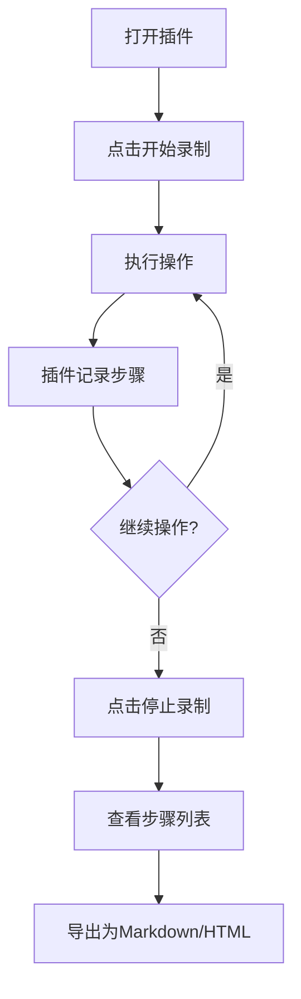

## 1. Product Overview
浏览器步骤图插件，用于记录用户操作并生成详细的步骤指南，类似ScribeHow/Tango功能。
- 主要目的是帮助用户快速记录和分享操作步骤，解决教程创建的繁琐问题
- 目标用户为技术文档撰写者、培训师和需要分享操作流程的专业人士

## 2. Core Features

### 2.1 User Roles
| Role | Registration Method | Core Permissions |
|------|---------------------|------------------|
| User | No registration required | Use all plugin features |

### 2.2 Feature Module
1. **插件控制面板**：录制开关、开始/停止按钮、步骤管理
2. **步骤记录**：点击捕获、元素选择器获取、文本提取
3. **步骤可视化**：元素高亮、红框标记、截图功能
4. **数据导出**：Markdown和HTML格式导出

### 2.3 Page Details
| Page Name | Module Name | Feature description |
|-----------|-------------|---------------------|
| 插件控制面板 | 录制控制 | 提供开始/停止录制按钮，显示录制状态 |
| 插件控制面板 | 步骤管理 | 显示已记录的步骤列表，支持编辑和删除 |
| 网页覆盖层 | 元素高亮 | 点击元素时显示红框标记，突出显示当前操作目标 |
| 导出界面 | 格式选择 | 提供Markdown和HTML两种导出格式选项 |
| 导出界面 | 导出操作 | 将记录的步骤转换为选定格式并下载 |

## 3. Core Process
用户打开插件 → 点击开始录制 → 执行操作（点击、输入等） → 插件自动记录步骤（包括截图、元素信息） → 点击停止录制 → 查看步骤列表 → 导出为Markdown或HTML格式

## 4. User Interface Design
### 4.1 Design Style
- 主色调：蓝色 (#3b82f6) 和红色 (#ef4444)
- 按钮样式：圆角矩形，有悬停效果
- 字体：无衬线字体，主标题16px，正文14px
- 布局风格：卡片式布局，简洁明了
- 图标风格：线性图标，简洁现代

### 4.2 Page Design Overview
| Page Name | Module Name | UI Elements |
|-----------|-------------|-------------|
| 插件控制面板 | 录制控制 | 大型开始/停止按钮，状态指示器，简洁的控制界面 |
| 插件控制面板 | 步骤管理 | 步骤列表，每个步骤显示缩略图和描述，编辑/删除按钮 |
| 网页覆盖层 | 元素高亮 | 红色边框，半透明背景，动画效果 |
| 导出界面 | 格式选择 | 选项卡式布局，清晰的格式选择按钮 |
| 导出界面 | 导出操作 | 明显的导出按钮，进度指示器 |

### 4.3 Responsiveness
- 插件界面自适应不同屏幕尺寸
- 在小屏幕设备上优化布局，确保操作便捷
- 支持触摸操作，适合平板电脑等设备

### 4.4 3D Scene Guidance
- 不适用，本产品为2D界面插件