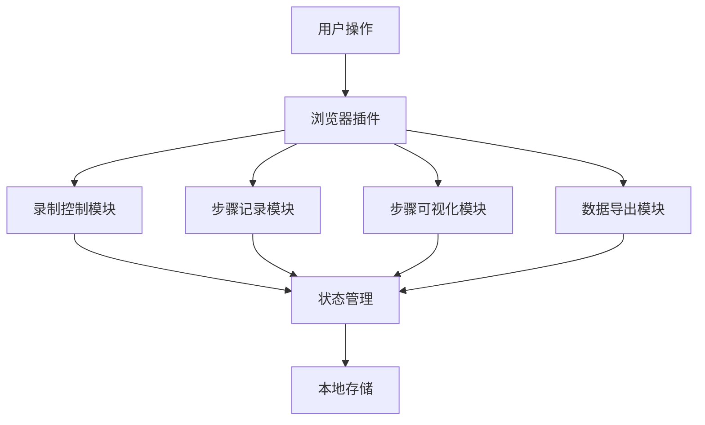
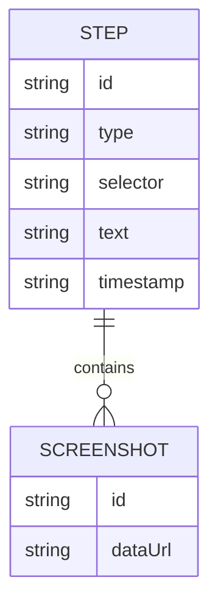

## 1. Architecture Design


## 2. Technology Description
- Frontend: 纯HTML + CSS + JavaScript
- 浏览器扩展技术: Chrome Extension API
- 存储: localStorage (本地存储步骤数据)
- 截图功能: html2canvas库
- 导出格式: Markdown和HTML

## 3. Route Definitions
| Route | Purpose |
|-------|---------|
| /popup.html | 插件弹出面板，提供录制控制和步骤管理 |
| /content.js | 注入到目标页面的内容脚本，用于捕获用户操作 |
| /background.js | 后台脚本，处理插件状态和消息传递 |
| /options.html | 插件选项页面，配置插件行为 |

## 4. API Definitions
### 4.1 消息传递API
| 消息类型 | 描述 | 参数 |
|---------|------|------|
| startRecording | 开始录制 | 无 |
| stopRecording | 停止录制 | 无 |
| captureStep | 捕获步骤 | {selector, text, screenshot} |
| getSteps | 获取所有步骤 | 无 |
| exportSteps | 导出步骤 | {format: 'markdown'  'html'} |

### 4.2 浏览器API
- chrome.runtime.sendMessage: 发送消息
- chrome.runtime.onMessage: 接收消息
- chrome.tabs.captureVisibleTab: 捕获标签页截图
- chrome.storage.local: 本地存储

## 5. Server Architecture Diagram
- 不适用，本插件为纯客户端实现，无需后端服务

## 6. Data Model
### 6.1 数据模型定义


### 6.2 数据存储
- 使用localStorage存储步骤数据
- 数据结构:
```javascript
const steps = [
  {
    id: "1",
    type: "click",
    selector: "#submit-button",
    text: "提交按钮",
    timestamp: "2023-07-01T12:00:00Z",
    screenshot: "data:image/png;base64,..."
  }
];
```